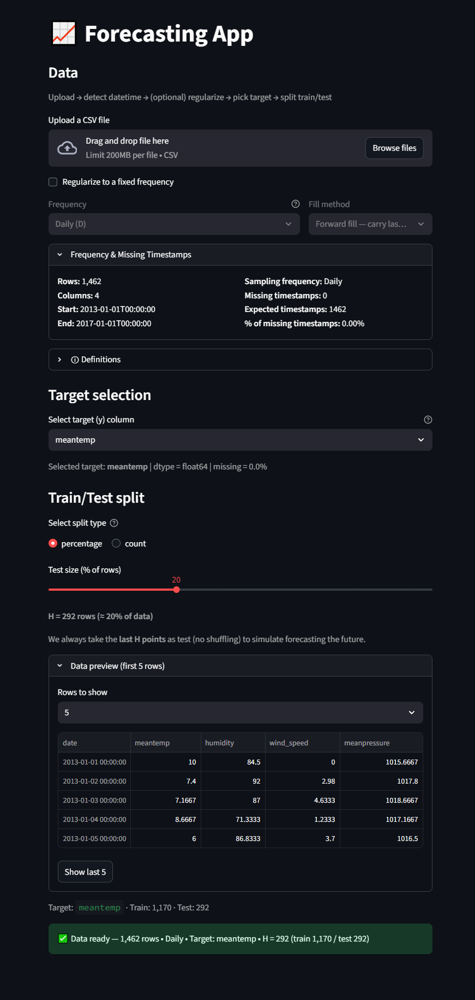
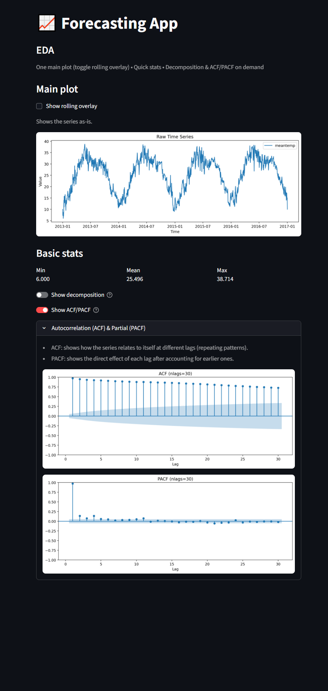
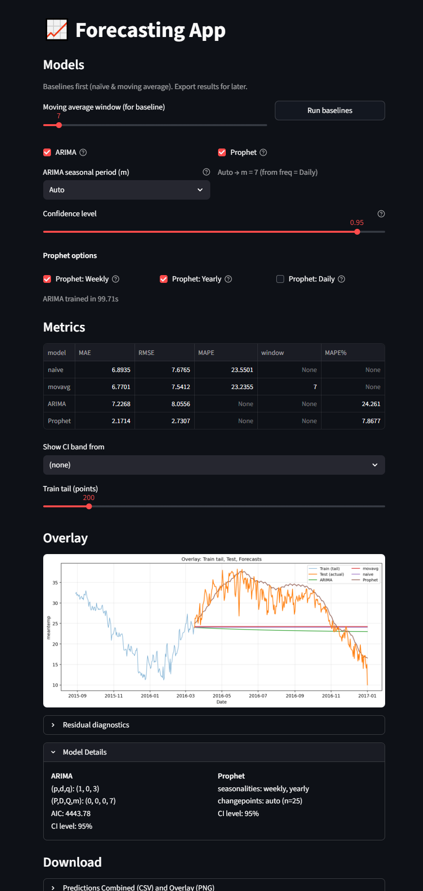
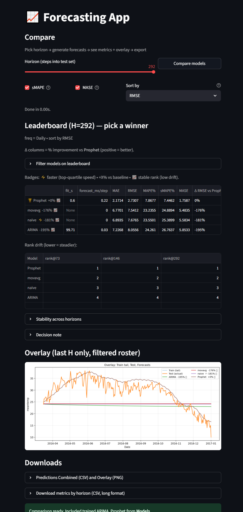

# Time-Series Forecasting App — v0.2

**Upload a CSV, explore EDA, run baselines & classical models, and compare forecasts.**  
Built with Streamlit, pandas, pmdarima/Prophet (optional).


---

## Key Features (v0.2)

- **Data Input & Validation**
  - Safe CSV upload, datetime auto-detection, frequency inference
  - Optional regularization to fixed frequency + gap filling

- **EDA**
  - Raw plot, rolling stats, variance bands
  - Quick summary stats

- **Forecasting Models**
  - Baselines: Naive, Moving Average
  - Classical (optional): Auto-ARIMA, Prophet
  - Chronological split (no shuffling), safe horizon validation

- **Compare**
  - Overlay last-H forecasts across models
  - Metrics leaderboard with Δ% vs baseline, runtime columns
  - Granularity for horizon metrics (3 points or All 1…H)

- **Exports**
  - Forecasts → CSV/PNG
  - Compare metrics by horizon → CSV

---

## Quick Start

> Tested with **Python 3.12** on Windows. Prophet may need a compiler toolchain.

```bash
# 1) Clone
git clone https://github.com/<your-username>/<your-repo>.git
cd <your-repo>

# 2) Create & activate venv
python -m venv .venv
.\.venv\Scripts\Activate.ps1  # Windows
# source .venv/bin/activate   # macOS/Linux

# 3) Install core requirements
pip install -r requirements.txt

# 4) (Optional) Classical models
pip install pmdarima prophet

# 5) Run
streamlit run app.py
```

Open the local URL that Streamlit prints (usually http://localhost:8501).

---

## Project Structure (typical)

```
<repo-root>/
├─ app.py
├─ src/
│  ├─ data_input.py
│  ├─ eda.py
│  ├─ baselines.py
│  ├─ classical.py
│  ├─ compare.py
│  └─ outputs.py
├─ assets/
│  ├─ demo.gif
│  ├─ eda.gif
│  ├─ models.gif
│  ├─ compare.gif
│  └─ screenshots/
│     ├─ data.png
│     ├─ eda.png
│     ├─ models.png
│     └─ compare.png
├─ requirements.txt
├─ README.md
├─ LICENSE
└─ CHANGELOG.md
```

---

## Screenshots

| Data Page | EDA Page | Models Page | Compare Page |
| --- | --- | --- | --- |
|  |  |  |  |


---

## Roadmap

- **v0.3 (ideas):**
  - Add screenshots/GIFs to repo (see placeholders above)
  - Stability indicator vs H
  - Model roster filters
  - Streamlit visual polish & theme
  - Hosted demo link (Streamlit Cloud)

---

## License

MIT License. See `LICENSE` for details.
